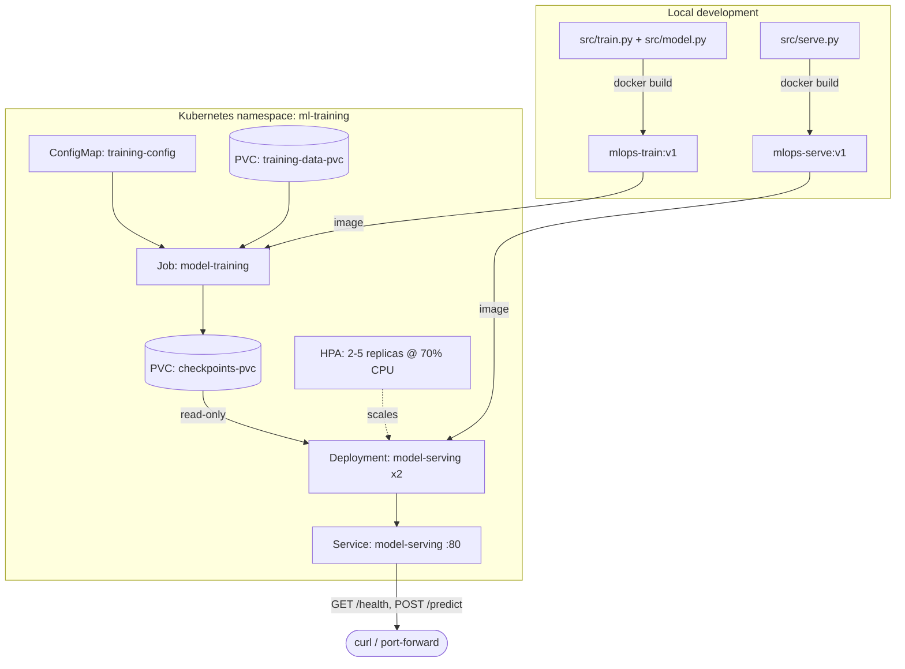

# mlops-pytorch-pipeline

Trains a ResNet-18 image classifier on CIFAR-10 with PyTorch, containerizes training and serving with Docker, and deploys both to Kubernetes (Job for training, Deployment + Service + HPA for serving).

## Architecture



Training runs to completion as a Job, writing a checkpoint to a shared PVC. The serving Deployment mounts that same PVC read-only and loads the checkpoint at startup; the Service exposes it, and the HPA scales replicas on CPU load.

## Repository layout

```
mlops-pytorch-pipeline/
├── src/                  # model.py, dataset.py, train.py, serve.py
├── configs/              # training_config.yaml
├── docker/               # Dockerfile.train, Dockerfile.serve
├── k8s/                  # namespace, configmap, pvc, job, deployment, service, hpa
├── requirements/         # train.txt, serve.txt
├── tests/                # test_model.py
└── .github/workflows/    # ci.yml
```

> `k8s/pvc.yaml` isn't in the assignment's listed file tree, but `training-job.yaml` requires a PersistentVolumeClaim for `/app/data` and `/app/checkpoints`, so it's defined there as `training-data-pvc` and `checkpoints-pvc`.

## Local development

```bash
python -m venv .venv && source .venv/bin/activate
pip install -r requirements/train.txt
pip install -r requirements/serve.txt   # to run the API locally too

# Train (downloads CIFAR-10 to ./data on first run)
CONFIG_PATH=configs/training_config.yaml python src/train.py

# Serve (after a checkpoint exists at ./checkpoints/classifier_v1.pt)
CHECKPOINT_PATH=checkpoints/classifier_v1.pt \
CONFIG_PATH=configs/training_config.yaml \
uvicorn serve:app --app-dir src --host 0.0.0.0 --port 8080
```

Run tests: `pytest tests/ -v`

## Docker

```bash
# Training image
docker build -f docker/Dockerfile.train -t mlops-train:v1 .
docker run --rm \
  -v $(pwd)/data:/app/data \
  -v $(pwd)/checkpoints:/app/checkpoints \
  mlops-train:v1

# Serving image
docker build -f docker/Dockerfile.serve -t mlops-serve:v1 .
docker run --rm -p 8080:8080 \
  -v $(pwd)/checkpoints:/app/checkpoints:ro \
  mlops-serve:v1

# Test
curl -X POST http://localhost:8080/predict -F "image=@test_image.png"
curl http://localhost:8080/health
```

## Kubernetes (Minikube / kind)

```bash
# Load images into the cluster first, e.g.:
#   kind load docker-image mlops-train:v1 mlops-serve:v1 --name <cluster-name>
#   minikube image load mlops-train:v1 && minikube image load mlops-serve:v1

kubectl apply -f k8s/namespace.yaml
kubectl apply -f k8s/configmap.yaml
kubectl apply -f k8s/pvc.yaml
kubectl apply -f k8s/training-job.yaml

kubectl wait --for=condition=complete job/model-training -n ml-training --timeout=3600s
kubectl logs job/model-training -n ml-training

kubectl apply -f k8s/serving-deployment.yaml
kubectl apply -f k8s/serving-service.yaml
kubectl apply -f k8s/hpa.yaml

kubectl get pods -n ml-training
kubectl describe deployment model-serving -n ml-training

kubectl port-forward svc/model-serving 8080:80 -n ml-training
curl -X POST http://localhost:8080/predict -F "image=@test_image.png"
```

> `checkpoints-pvc` uses `ReadWriteOnce`. On a single-node cluster (Minikube/kind) the training Job and serving Pods land on the same node, so this works; on a multi-node cluster you'd need `ReadWriteMany` storage instead.

## Known gotchas (found during validation)

- **NumPy/PyTorch ABI mismatch**: `torch==2.2.2` requires `numpy<2`. Without pinning it, pip installs NumPy 2.x as a transitive dependency and every operation touching image tensors crashes with `RuntimeError: Numpy is not available`. Fixed by pinning `numpy==1.26.4` in both `requirements/train.txt` and `requirements/serve.txt`.
- **CPU thread oversubscription in constrained containers**: PyTorch defaults its intra-op thread pool to the node's total CPU count, not the container's cgroup CPU limit. With a 2-CPU limit but 12 threads spawned, training thrashed on scheduling contention instead of computing. Fixed by setting `OMP_NUM_THREADS`/`MKL_NUM_THREADS` to match the CPU limit in `k8s/training-job.yaml`.
- **Hardware constraint - CPU-only training is slow**: this pipeline was validated on CPU only (no GPU access), and the training Job's resource limit caps it at 2 CPU cores. Even after fixing the thread-oversubscription issue above, a single epoch of ResNet-18 over the full CIFAR-10 dataset (50k train / 10k val images) took roughly **45 minutes to an hour**. Plan accordingly when running the full `epochs: 10` config from `k8s/configmap.yaml` - that's several hours of wall-clock time on CPU. Running on a GPU node would reduce this dramatically, but that's out of scope here (`k8s/training-job.yaml` only requests CPU/memory, no GPU resources).

## Git workflow

- `main` — protected, only updated via merged PRs.
- `develop` — integration branch, branched from `main`.
- `feature/*` — one branch per unit of work, merged into `develop` via PR.
- Commits follow [Conventional Commits](https://www.conventionalcommits.org/) (`feat:`, `fix:`, `docs:`, etc).
