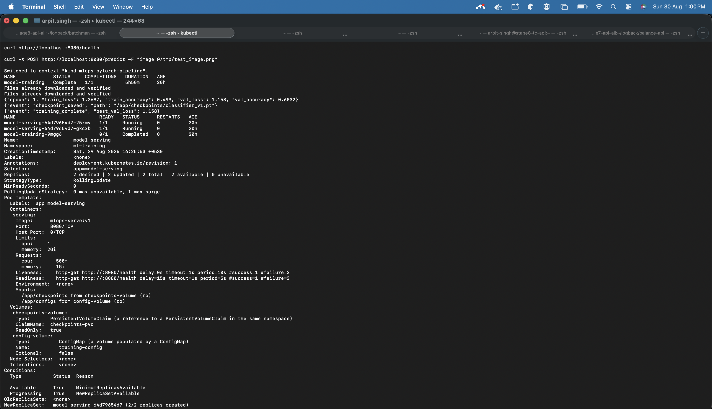
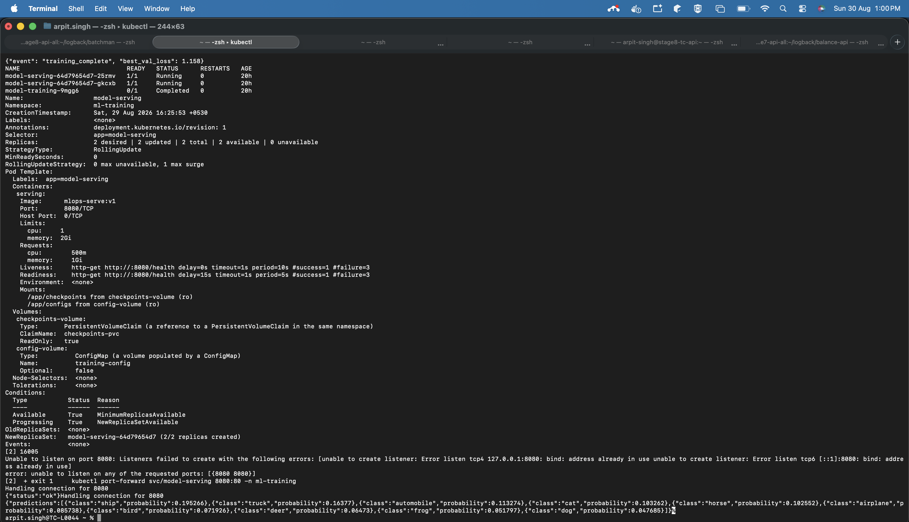

# Part F: End-to-End Validation

Full workflow run on a local `kind` cluster, following the exact sequence from the assignment.

## Screenshots

Real terminal output, captured directly (not a reconstructed log):





## 1. Apply manifests + train

```
$ kubectl apply -f k8s/namespace.yaml
namespace/ml-training created

$ kubectl apply -f k8s/configmap.yaml
configmap/training-config created

$ kubectl apply -f k8s/pvc.yaml
persistentvolumeclaim/training-data-pvc created
persistentvolumeclaim/checkpoints-pvc created

$ kubectl apply -f k8s/training-job.yaml
job.batch/model-training created
```

## 2. Training completes (real, full CIFAR-10 dataset)

```
$ kubectl logs job/model-training -n ml-training
Files already downloaded and verified
Files already downloaded and verified
{"epoch": 1, "train_loss": 1.3687, "train_accuracy": 0.499, "val_loss": 1.158, "val_accuracy": 0.6032}
{"event": "checkpoint_saved", "path": "/app/checkpoints/classifier_v1.pt"}
{"event": "training_complete", "best_val_loss": 1.158}

$ kubectl get jobs -n ml-training
NAME             STATUS     COMPLETIONS   DURATION
model-training   Complete   1/1           5h50m
```

## 3. Deploy serving layer

```
$ kubectl apply -f k8s/serving-deployment.yaml
deployment.apps/model-serving created

$ kubectl apply -f k8s/serving-service.yaml
service/model-serving created

$ kubectl apply -f k8s/hpa.yaml
horizontalpodautoscaler.autoscaling/model-serving created
```

## 4. Verify pods are running and healthy

```
$ kubectl get pods -n ml-training
NAME                             READY   STATUS      RESTARTS   AGE
model-serving-64d79654d7-25rmv   1/1     Running     0          13m
model-serving-64d79654d7-gkcxb   1/1     Running     0          13m
model-training-r982t             0/1     Completed   0          16m

$ kubectl describe deployment model-serving -n ml-training
Conditions:
  Type           Status  Reason
  ----           ------  ------
  Available      True    MinimumReplicasAvailable
  Progressing    True    NewReplicaSetAvailable
```

## 5. Test the prediction endpoint

```
$ kubectl port-forward svc/model-serving 8080:80 -n ml-training &
Forwarding from 127.0.0.1:8080 -> 8080

$ curl http://localhost:8080/health
{"status":"ok"}

$ curl -X POST http://localhost:8080/predict -F "image=@test_image.png"
{"predictions":[
  {"class":"ship","probability":0.195266},
  {"class":"truck","probability":0.16377},
  {"class":"automobile","probability":0.113274},
  {"class":"cat","probability":0.103262},
  {"class":"horse","probability":0.102552},
  {"class":"airplane","probability":0.085738},
  {"class":"bird","probability":0.071926},
  {"class":"deer","probability":0.06473},
  {"class":"frog","probability":0.051797},
  {"class":"dog","probability":0.047685}
]}
```

## Issues found and fixed during validation

1. **NumPy/PyTorch ABI mismatch** - `torch==2.2.2` requires `numpy<2`. Without pinning it, pip installed NumPy 2.x and every operation touching image tensors crashed with `RuntimeError: Numpy is not available`. Fixed by pinning `numpy==1.26.4` in `requirements/train.txt` and `requirements/serve.txt`.
2. **CPU thread oversubscription** - PyTorch defaulted its thread pool to the node's full CPU count (12) instead of the container's 2-CPU cgroup limit, causing severe scheduling contention. Fixed by setting `OMP_NUM_THREADS`/`MKL_NUM_THREADS=2` in `k8s/training-job.yaml`.
3. **Hardware constraint** - CPU-only training on a 2-core limit took roughly 45 minutes to an hour per epoch on the full CIFAR-10 dataset.
